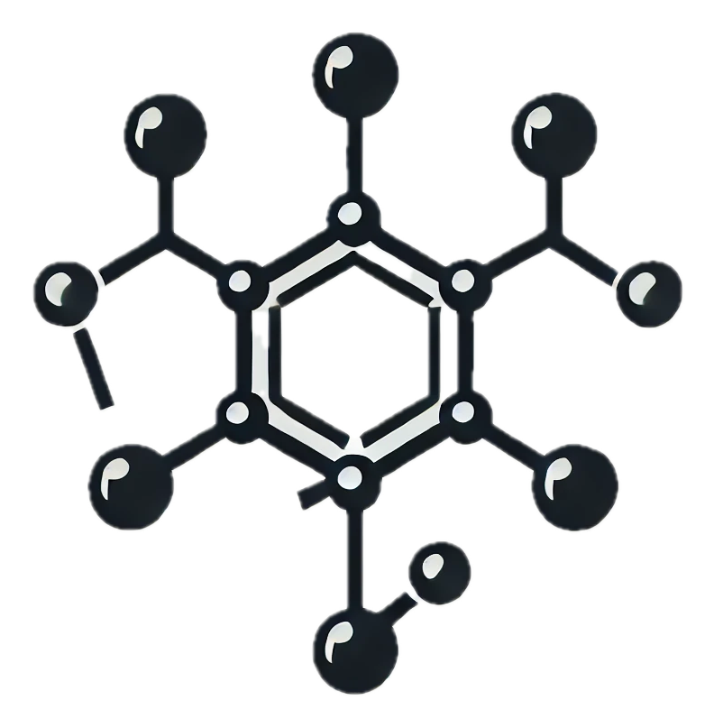

# ferroin
GraphKAN for Small Molecule-Protein Interaction Predictions

  

OpenReview link. Read from [here](https://openreview.net/forum?id=d5uz4wrYeg&referrer=%5Bthe%20profile%20of%20Tashin%20Ahmed%5D(%2Fprofile%3Fid%3D~Tashin_Ahmed1)).

Author: Tashin Ahmed and <a href="https://github.com/habibsifat">Md Habibur Rahman Sifat</a>

> [!IMPORTANT]
> **~~Source code will be available by the start of August 2024.~~ Repairing my country (Bangladesh), it might take a while to get back on work and focus on the career. Sorry if you came here with a hope of getting something.** 

> [!TIP]
>**Work in progress. Create PR if you want to contribute and extend it.**

