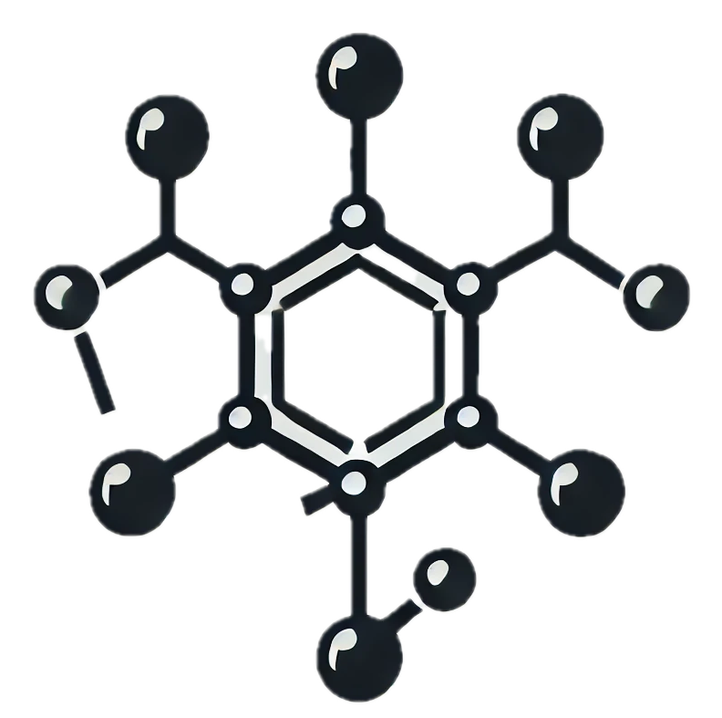

  

# ferroin
GraphKAN for Small Molecule-Protein Interaction Predictions

Author: Tashin Ahmed and <a href="https://github.com/habibsifat">Md Habibur Rahman Sifat</a>

> [!IMPORTANT]
> **~~Source code will be available by the start of August 2024.~~ Repairing my country (Bangladesh), it might take a while to get back on work and focus on the career. Sorry if you came here with a hope of getting something.**
