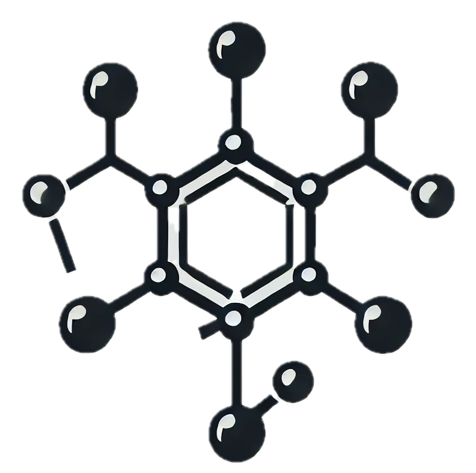

# ferroin

**GraphKAN: Graph Kolmogorov-Arnold Network for Small Molecule-Protein Interaction Predictions**

<p align="center">
  
</p>

Companion code for the ICML 2024 Workshop (ML4LMS) paper:

> Tashin Ahmed & Md Habibur Rahman Sifat. *GraphKAN: Graph Kolmogorov Arnold
> Network for Small Molecule-Protein Interaction Predictions.*
> [OpenReview](https://openreview.net/forum?id=d5uz4wrYeg) · [PDF](https://openreview.net/pdf?id=d5uz4wrYeg)

GraphKAN replaces the MLP message functions of a GNN with **Fourier-series
Kolmogorov-Arnold Network (KAN)** layers, and is used here to predict whether a
small molecule binds to one of three protein targets (`sEH`, `BRD4`, `HSA`),
following the [Leash-BIO Predict New Medicines](https://www.kaggle.com/competitions/leash-BIO)
data format.

---

## What's new (v0.2.3)

This release is a **bug-fix and packaging rewrite** that makes the original
proof-of-concept actually runnable. The model architecture and mathematics of
the paper are unchanged. Highlights:

- **Packaging with [`uv`](https://docs.astral.sh/uv/)** — a single
  `pyproject.toml`, an installable `ferroin` package, and a `ferroin` CLI.
- **Fixed every crash** in the original scripts (see
  [Issues fixed](#issues-fixed-in-this-release)).
- **Proper package layout** under `src/ferroin/` with consistent imports —
  `from src.data_creation import ...` / flat-import mixing is gone.
- **CLI + `Config` dataclass** so every hyperparameter is overridable without
  editing code, plus a `--smoke-test` mode for a 1-minute sanity run.
- **Reproducible training**: global seeding, an optional validation split, and
  best-checkpoint tracking.
- **Robust data paths** resolved relative to the project root (overridable via
  environment variables / CLI).
- **Tests** that run offline (no dataset required): `pytest`.

---

## Project layout

```
ferroin/
├── pyproject.toml            # uv / pip project definition
├── .gitignore
├── README.md
├── LICENSE
├── ferroin.png
├── data/                     # YOU place train.parquet / test.parquet here
│   ├── train.parquet
│   └── test.parquet
├── src/ferroin/
│   ├── __init__.py
│   ├── cli.py                # `ferroin` command-line entry point
│   ├── main.py               # run_pipeline(): load -> featurize -> train -> predict
│   ├── preprocessing.py      # DuckDB fetch of balanced train + full test
│   ├── data_fetcher.py       # SQL helpers (balanced_data_creation, protein_data)
│   ├── data_creation.py      # SMILES -> PyG Data graphs
│   ├── featurizing.py        # Test-set featurization + slicing
│   ├── featurizer.py         # atom_features, bond_features, feature dims
│   ├── gnn_model.py          # NaiveFourierKANLayer + CustomGNNLayer + GNNModel
│   ├── train.py              # training loop w/ validation + best checkpoint
│   ├── predict.py            # sigmoid inference, robust id handling
│   └── parameters.py         # Config dataclass, defaults, set_seed()
└── tests/
    ├── test_smoke.py         # offline tests (no data needed)
    └── test_dataset_shapes.py
```

---

## Requirements

- **Python 3.10 – 3.12** (the `rdkit` wheels currently have no 3.13 builds).
- [`uv`](https://docs.astral.sh/uv/) 0.4+ (recommended) **or** plain pip.
- Works on Linux, Windows, and macOS (Apple Silicon). On **Intel macOS** the
  newest `torch`/`rdkit` no longer ship x86_64 wheels — pin
  `torch==2.2.2` and `rdkit==2024.3.5`, or use conda for RDKit.

### Install uv (if you don't have it)

```bash
# macOS / Linux
curl -LsSf https://astral.sh/uv/install.sh | sh
# Windows (PowerShell)
powershell -ExecutionPolicy ByPass -c "irm https://astral.sh/uv/install.ps1 | iex"
```

---

## Setup

From the repository root:

```bash
# 1. Create a virtual environment and install the project (+ dev + wandb extras)
uv sync --extra dev --extra wandb
```

This creates `.venv/`, installs `torch`, `torch-geometric`, `rdkit`, `duckdb`,
`pandas`, `numpy`, `tqdm`, plus `pytest`/`ruff`/`pylint` and optional `wandb`.

> **GPU / CUDA users:** uv installs the default PyPI torch. For a CUDA build,
> add the PyTorch index, e.g. for CUDA 12.1:
>
> ```bash
> uv sync --extra dev --extra-index-url https://download.pytorch.org/whl/cu121
> ```

---

## Data

Place the Leash-BIO parquet files in `data/` (or point to them with `--train-path`
/ `--test-path` or the `FERROIN_TRAIN_PATH` / `FERROIN_TEST_PATH` env vars):

```
data/
├── train.parquet    # columns: id, molecule_smiles, protein_name, binds, ...
└── test.parquet     # columns: id, molecule_smiles, protein_name, ...
```

Download from the
[Kaggle competition page](https://www.kaggle.com/competitions/leash-BIO/data).

---

## Quick start

### 1. Verify the install (no data needed)

```bash
uv run pytest -q          # offline smoke tests
uv run ferroin --help     # CLI help
```

### 2. Smoke run (needs data, ~1 min)

A tiny config (1 protein, 200 samples/class, 1 epoch) to confirm the full
pipeline runs end-to-end:

```bash
uv run ferroin --smoke-test
```

### 3. Full run

```bash
uv run ferroin \
  --train-path data/train.parquet \
  --test-path  data/test.parquet \
  --proteins sEH BRD4 HSA \
  --samples-per-category 30000 \
  --epochs 5 --layers 6 --hidden-dim 64 --grid-size 300 \
  --lr 1e-3 --dropout 0.3 --val-frac 0.1 --seed 42
```

This will, **for each protein**:

1. sample a class-balanced training subset (DuckDB),
2. featurize molecules into PyG graphs,
3. train a GraphKAN model (keeping the best checkpoint by validation loss),
4. save the checkpoint to `trained_models/<protein>_model_<epochs>.pth`,
5. predict binding probabilities on the test set.

Predictions for all proteins are concatenated and written to
`predictions/final_predictions.csv` (columns: `id`, `binds`).

### 4. Use it as a library

```python
from ferroin.parameters import Config
from ferroin.main import run_pipeline

cfg = Config(epochs=10, layers=6, hidden_dim=64, use_wandb=True)
final_df = run_pipeline(cfg)   # pandas.DataFrame with columns ['id', 'binds']
```

---

## Configuration

All hyperparameters live in `ferroin/parameters.py` as a `Config` dataclass
with sensible defaults, and can be overridden via:

| Source               | Example                                      |
| -------------------- | -------------------------------------------- |
| CLI flag             | `--epochs 10 --layers 6`                   |
| Environment variable | `FERROIN_TRAIN_PATH=/data/train.parquet`   |
| Programmatic         | `Config(epochs=10)` or `cfg.epochs = 10` |

Key defaults: `epochs=5`, `layers=6`, `hidden_dim=64`, `grid_size=300`,
`lr=1e-3`, `dropout=0.3`, `samples_per_category=30000`, `val_frac=0.1`,
`seed=42`.

### Weights & Biases (optional)

```bash
uv run wandb login           # one time
uv run ferroin --wandb --wandb-project GraphKAN_Protein_Binding ...
```

---

## The GraphKAN model

The core idea (unchanged from the paper): in each message-passing layer the
incoming message `concat(x_j, edge_attr)` is transformed by a
**Fourier-series KAN layer** instead of an MLP:

- `NaiveFourierKANLayer` learns `(2, out, in, grid)` coefficients for the
  `cos`/`sin` basis of frequencies `k = 1..grid`, combined via an `einsum`.
- `CustomGNNLayer` (`MessagePassing`, `aggr='max'`) wraps the KAN layer.
- `GNNModel` stacks `layers` of them with `BatchNorm1d` + `ReLU` + `Dropout`,
  then `global_max_pool` and a linear readout producing a binding logit.

See `src/ferroin/gnn_model.py`.

---

## Tests

```bash
uv run pytest -q          # offline (no dataset required)
uv run ruff check src tests
```

`tests/test_smoke.py` builds a few tiny molecules, runs a forward+backward pass
through the GraphKAN model, and checks the predict helper — a fast way to
confirm the environment and code are healthy.

---

## Issues fixed in this release

The original proof-of-concept scripts could not run as-is. Every one of these
was fixed:

1. **`featurizing.py`** called `feat_data_in_batches(...)` with a missing
   `ids_list` argument (`TypeError`).
2. **`featurizing.py`** reassigned `test_data_sliced` inside `main()`,
   shadowing the module-level dict that `main.py` imported (always empty).
3. **`featurizing.py`** used placeholder paths (`'path_to_brd4_test.csv'`).
4. **`data_creation.py`** referenced undefined globals `seh_df` / `brd4_df` /
   `hsa_df` in `main()` (`NameError`).
5. **`main.py`** consumed empty module-level dicts (`featurized_data_train`,
   `test_data_sliced`) — the pipeline never actually produced data.
6. **`predict.py`** called `.cpu()` on `molecule_id`, which is a Python int
   collated into a list (crash).
7. **`main.py`** called `.item()` on ids assuming tensors (crash on ints).
8. **`gnn_model.py`** hardcoded the edge feature dimension as `in_channels + 6`
   — now parameterized via `edge_dim`.
9. **`test_dataset_shapes.py`** compared balanced subsets against full-dataset
   shapes, so the check always "failed" — now correct (`2 * samples_per_category`).
10. **Imports** mixed `from src.x` and flat `from x` with no `__init__.py` —
    replaced by a single installable `ferroin` package.
11. **No seeding** — added global `set_seed()` for reproducibility.
12. **No validation / checkpointing** — training now keeps the best model by
    validation loss.
13. **Incomplete `requirements.txt`** — replaced by a complete `pyproject.toml`
    managed by `uv`.
14. Removed dead/unused imports (`wandb`, `DataLoader`) and redundant CSV writes.

---

## Citation

If you use this code, please cite the paper:

```bibtex
@inproceedings{ahmed2024graphkan,
  title     = {GraphKAN: Graph Kolmogorov Arnold Network for Small Molecule-Protein
               Interaction Predictions},
  author    = {Ahmed, Tashin and Sifat, Md Habibur Rahman},
  booktitle = {ICML 2024 Workshop on Machine Learning for Low-resource Sensors},
  year      = {2024},
  url       = {https://openreview.net/forum?id=d5uz4wrYeg}
}
```

## License

MIT License — Copyright (c) 2024 Tashin Ahmed. See [LICENSE](LICENSE).
